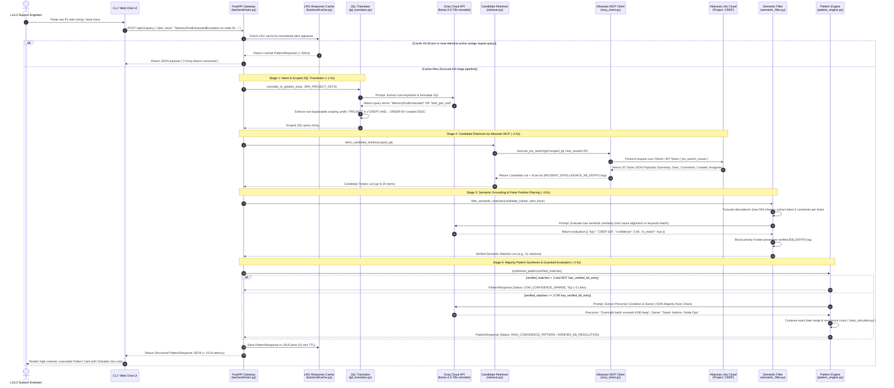
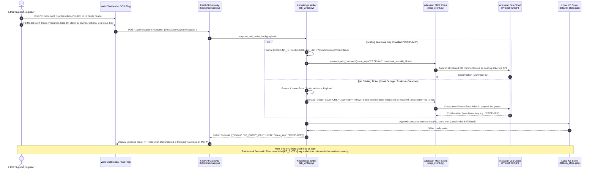
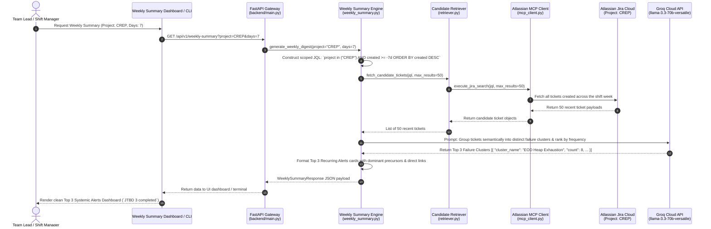

# Architecture Implementation Plan: Incident Intelligence (v1 Prototype)
**Master Architectural Blueprint & Technical Engineering Plan via Atlassian MCP & Groq (`llama-3.3-70b-versatile`)**

---

## 1. Executive Summary & Purpose

This document serves as the master architectural blueprint (`ArchitecturePlan.md`) connecting the operational problem specifications in [problemStatement.md](file:///c:/Users/GS/Desktop/Incident%20Intelligence/problemStatement.md) with the phase-wise engineering roadmap defined in [ImplementationPlan.md](file:///c:/Users/GS/Desktop/Incident%20Intelligence/ImplementationPlan.md). 

When a critical P1 alert triggers at 2am (e.g., during overnight statement generation `stmt_gen_eod` or reconciliation batches), L1/L2 production support engineers waste **30–60 minutes** searching Jira queues and Slack histories asking: *"Have we seen this exact alert before? What caused it right before it triggered? Who resolved it, and what is the exact Jira ticket?"*

**Incident Intelligence (v1)** resolves the **"2am P1 Triage Crisis"** by establishing an agentic, two-stage retrieval and pattern-synthesis architecture over the **Atlassian MCP Server (`jira_search_issues`)** and **Groq Cloud (`llama-3.3-70b-versatile`)**. Operating strictly within a **10–15 second latency SLA** and respecting Groq free-tier rate limits (**30 RPM / 12,000 TPM**), the architecture guarantees:
1. **Mandatory Project Scoping:** All Atlassian MCP JQL searches enforce `PROJECT in ("{JIRA_PROJECT_KEYS}") AND ... ORDER BY created DESC`, preventing data leaks across business units and eliminating global search overhead.
2. **True Semantic Grounding:** Eliminates keyword-only false positives by evaluating real candidate ticket descriptions and comments via `llama-3.3-70b-versatile`.
3. **Majority-Rule Pattern Extraction:** Enforces strict **>50% majority-rule thresholds** across matched ticket histories to identify the dominant **Precursor Condition** and **Escalation Owner**.
4. **Sparse Match Guardrails:** Explicitly outputs low-confidence warnings (`LOW_CONFIDENCE_SPARSE`) when fewer than 3 historical matches exist (`< 3 matches`).
5. **Continuous Learning & Resolution Externalization:** Integrates a feedback loop (`kb_writer.py` / `learning_loop.py`) that captures fresh post-resolution analyses and writes them directly back into Jira via the Atlassian MCP Server (`jira_add_comment` / `jira_create_issue`) or local index (`data/kb_store.json`), immediately prioritizing them (`VERIFIED_KB_RESOLUTION`) on all subsequent recurrences.

---

## 2. End-to-End System Context & Boundary Layering

The visual architecture and data flows are organized across five distinct operational boundaries: Client Presentation Layer, FastAPI Gateway Layer, Intelligence & Processing Layer, Integration Bridge Layer (`MCP & Groq`), and External Storage Layer (`Jira Cloud & Local KB`).


```mermaid
graph TD
    %% Tier 1: Client Layer
    subgraph Client_Layer ["1. Client Presentation Tier"]
        CLI["Interactive Terminal Client<br/>(cli/run.py | rich/colorama)"]
        WebUI["Dark-Mode Web Chat UI & Modal<br/>(ui/index.html | ui/app.js)"]
    end

    %% Tier 2: Gateway & API Layer
    subgraph Gateway_Layer ["2. FastAPI Gateway Layer (backend/main.py)"]
        Router["Async REST API Router<br/>(/api/v1/query | /api/v1/capture-resolution | /api/v1/weekly-summary)"]
        Validator["Pydantic Schema Validator<br/>(backend/models.py)"]
        Cache["LRU Query Response Cache<br/>(In-Memory / SQLite | 15-min TTL)"]
    end

    %% Tier 3: Core Intelligence Processing Tier
    subgraph Intelligence_Layer ["3. Core Intelligence Processing Tier (backend/)"]
        JQL_Trans["Scoped JQL Translator<br/>(jql_translator.py)"]
        Retriever["Candidate Ticket Retriever<br/>(retriever.py)"]
        Sem_Filter["Semantic Grounding Filter<br/>(semantic_filter.py)"]
        Pat_Engine["Pattern Synthesis & Guardrails<br/>(pattern_engine.py)"]
        Stats_Calc["Temporal Stats Calculator<br/>(stats_calculator.py)"]
        KB_Writer["Continuous Learning Writer<br/>(kb_writer.py | learning_loop.py)"]
        Weekly_Sum["Shift Lead Weekly Summary Engine<br/>(weekly_summary.py)"]
    end

    %% Tier 4: Protocol Bridge Tier
    subgraph Protocol_Layer ["4. Protocol Integration Bridge Tier"]
        Groq_Client["Groq LLM Wrapper & Token Budgeter<br/>(llm_client.py | llama-3.3-70b-versatile)"]
        MCP_Client["Atlassian MCP Client Protocol Bridge<br/>(mcp_client.py | mcp SDK stdio/SSE)"]
    end

    %% Tier 5: External & Storage Tier
    subgraph External_Tier ["5. External Services & Persistent Storage"]
        Groq_Cloud["Groq Cloud API<br/>(30 RPM / 12,000 TPM limit)"]
        Atlassian_Server["Atlassian MCP Server<br/>(mcpservers.org)"]
        Jira_Cloud["Atlassian Jira Cloud Instance<br/>(Target Projects: CREP, OPS)"]
        KB_Store[("Local Knowledge Index<br/>(data/kb_store.json)")]
    end

    %% Connections across tiers
    CLI <-->|HTTP / Python Call| Router
    WebUI <-->|POST /api/v1/*| Router
    Router <--> Validator
    Router --> Cache
    Cache -.->|Cache Miss| JQL_Trans

    JQL_Trans <-->|Prompt Execution| Groq_Client
    JQL_Trans --> Retriever
    Retriever <-->|Call Tool: jira_search_issues| MCP_Client
    Retriever <-->|Check Verified [KB_ENTRY]| KB_Store
    Retriever --> Sem_Filter

    Sem_Filter <-->|Semantic Evaluation Prompt| Groq_Client
    Sem_Filter --> Pat_Engine
    Pat_Engine <-->|Majority Pattern (>50%) Prompt| Groq_Client
    Pat_Engine <-->|Compute Recurrence & Range| Stats_Calc
    Pat_Engine -->|Return PatternResponse (< 15s)| Router

    Router -->|Post-Resolution Capture| KB_Writer
    KB_Writer <-->|Call Tool: jira_add_comment / jira_create_issue| MCP_Client
    KB_Writer -->|Append Entry| KB_Store

    Router -->|Weekly Summary Request| Weekly_Sum
    Weekly_Sum <-->|7-Day JQL Fetch| Retriever
    Weekly_Sum <-->|Cluster Failure Modes| Groq_Client

    Groq_Client <-->|HTTPS API| Groq_Cloud
    MCP_Client <-->|stdio / SSE Protocol| Atlassian_Server
    Atlassian_Server <-->|OAuth / API Token| Jira_Cloud
```

---

## 3. Phase-by-Phase Architectural Module Blueprints

Directly implementing the four sequential phases of [ImplementationPlan.md](file:///c:/Users/GS/Desktop/Incident%20Intelligence/ImplementationPlan.md), the system design maps each technical requirement to a concrete module architecture.

### Phase 1: Foundation, Environment Scaffolding & MCP Configuration
**Goal:** Establish the Python backend execution environment, configure the `llama-3.3-70b-versatile` Groq wrapper with strict token budgeting, and scaffold the Atlassian MCP client connection.

#### 1.1 Backend Configuration & API Gateway (`backend/config.py`, `backend/main.py`)
- **`Settings` Class (`backend/config.py`):** Utilizes `pydantic-settings` to load immutable configuration variables from `.env`. Enforces presence of `GROQ_API_KEY`, `ATLASSIAN_CLOUD_URL`, `ATLASSIAN_MCP_CONFIG`, and `JIRA_PROJECT_KEYS` (`CREP,OPS`).
- **`FastAPI` Gateway (`backend/main.py`):** Configures async REST endpoints with CORS middleware:
  - `POST /api/v1/query`: Ingests `QueryRequest`, checks `LRUCache`, and orchestrates the 4-stage triage pipeline.
  - `POST /api/v1/capture-resolution`: Ingests `ResolutionCaptureRequest` and executes the continuous learning write-back loop.
  - `GET /api/v1/weekly-summary`: Executes the shift lead weekly pattern clustering query.

#### 1.2 Groq LLM Client & Token Budgeter (`backend/llm_client.py`)
- **`GroqClientWrapper` Architecture:**
  - Interfaces directly with `llama-3.3-70b-versatile` via the official `groq` Python SDK.
  - **Token Budgeter & Backoff State Machine:** Tracks rolling per-minute token usage against the `12,000 TPM` ceiling. If rate consumption exceeds 85% of the window or a `429 Too Many Requests` status is encountered, the wrapper automatically executes exponential backoff jitter (`0.5s -> 1.0s -> 2.0s`).
  - **LRU Response & Token Cache:** Intercepts identical alert signatures during high-volume active outages, serving cached `PatternResponse` payloads in `< 50ms` (`0 Groq tokens consumed`).

#### 1.3 Atlassian MCP Protocol Client (`backend/mcp_client.py`)
- **`McpClientWrapper` Architecture:**
  - Implements the Model Context Protocol client using the official `mcp` SDK.
  - Supports dual transport modes: `stdio` (spawning the local Atlassian MCP bridge process) and `SSE` (connecting to remote MCP endpoints).
  - Exposes three typed tool wrappers to internal modules:
    1. `execute_jira_search(jql: str, max_results: int = 20) -> List[Dict]`
    2. `execute_add_comment(issue_key: str, comment_text: str) -> Dict`
    3. `execute_create_issue(project_key: str, summary: str, description: str) -> Dict`
  - **Strict Architectural Guardrail:** All Jira interactions must pass through this MCP client wrapper. No custom REST API fetch scripts or ad-hoc `requests.get` calls are permitted.

---

### Phase 2: Core Matching Logic & Retrieval Grounding Engine
**Goal:** Implement the explicit two-stage retrieval and semantic similarity grounding pipeline that strictly scopes JQL queries and prevents hallucination.

#### 2.1 Scoped JQL Query Translator (`backend/jql_translator.py`)
- **`JqlTranslator` Architecture:**
  - Ingests raw stack traces (`MemoryPoolExhaustedException on app-client-rep-04 during stmt_gen_eod`) and formats them into `JQL_TRANSLATION_PROMPT`.
  - **Enforced Scoping Guardrail:** Executes a regex check prior to returning the JQL. If the Groq output lacks project restrictions, the translator forcefully prefixes `PROJECT in ("{JIRA_PROJECT_KEYS}") AND ` and appends ` ORDER BY created DESC`.

#### 2.2 Candidate Ticket Retrieval Engine (`backend/retriever.py`)
- **`CandidateRetriever` Architecture:**
  - Receives the scoped JQL query and invokes `mcp_client.execute_jira_search(jql, max_results=20)`.
  - Parses raw Jira JSON responses into a clean `List[JiraTicketCandidate]` (extracting `summary`, `description`, top 3 recent `comments`, `created_timestamp`, and `assignee_name`).
  - Simultaneously scans `data/kb_store.json` and ticket comments for verified `[INCIDENT_INTELLIGENCE_KB_ENTRY]` tags. If found, marks the candidate `has_verified_kb_entry = True`.

#### 2.3 Semantic Grounding & False Positive Filter (`backend/semantic_filter.py`)
- **`SemanticFilter` Architecture:**
  - **Dynamic Truncation Layer:** To keep multi-ticket evaluation prompts under the **3,500 token ceiling**, the filter truncates each candidate's `description` to `max 500 characters` and isolates only the latest `3 comments`.
  - **Groq Grounding Evaluation:** Batches candidate tickets into `SEMANTIC_GROUNDING_PROMPT` and queries `llama-3.3-70b-versatile`. The model evaluates true semantic similarity (root-cause alignment rather than shared generic words like `"Exception"`) and returns `is_semantic_match: bool` and `confidence_score: float` (0.0 to 1.0) per ticket.
  - **Priority Override:** If any candidate ticket possesses `has_verified_kb_entry = True`, it is assigned a `confidence_score = 1.0` and immediately boosted to the top of the verified matches list.

---

### Phase 3: Majority-Rule Pattern Synthesis & Confidence Guardrails
**Goal:** Build the pattern extraction engine (`step 3` of requirements) that computes frequency, exact date ranges, precursor conditions, escalation owners, and enforces confidence thresholds.

#### 3.1 Pattern Synthesis & Guardrails Engine (`backend/pattern_engine.py`, `stats_calculator.py`)
- **`PatternEngine` Architecture:**
  - **Sparse Match Threshold Check (`len(verified_matches) < 3`):**
    - If `len(verified_matches) == 0`: Returns status `NO_MATCHES_FOUND`.
    - If `len(verified_matches) in [1, 2]` (and `has_verified_kb_entry == False`): Returns status `LOW_CONFIDENCE_SPARSE`. Populates `top_ticket_links` with the 1–2 matched tickets, but explicitly suppresses generalized precursor conditions and owner claims, returning: *"⚠️ Low Confidence: Only {count} historical match(es) found. This does not yet establish a verified recurring pattern."*
  - **Majority-Rule Extraction (`len(verified_matches) >= 3` OR `has_verified_kb_entry == True`):**
    - Concatenates verified ticket descriptions and comments into `MAJORITY_PATTERN_EXTRACTION_PROMPT`.
    - **Precursor Condition Extraction (`>50% Rule`):** Instructs Groq to extract the specific system state triggering the failure **ONLY IF** it is documented across `>50%` of matched tickets. Otherwise outputs: *"No single dominant precursor condition across matches (varied triggers)."*
    - **Escalation Owner Extraction (`>50% Rule`):** Extracts the primary engineer or shift team **ONLY IF** they owned or resolved `>50%` of the occurrences. Otherwise outputs the top two teams and notes the distribution split.
- **`StatsCalculator` (`backend/stats_calculator.py`):**
  - Evaluates `created_timestamp` across verified matches in `< 50ms`.
  - Formats exact recurrence strings: e.g., *"11 times in 6 months between Jan 12, 2026 – Jul 02, 2026"*.

#### 3.2 Continuous Learning Loop & KB Write-Back (`backend/kb_writer.py`, `backend/learning_loop.py`)
- **`KnowledgeCaptureEngine` Architecture:**
  - Powers `JTBD 2: Post-Resolution Externalization`. When an engineer resolves a novel or low-confidence issue (`< 3 matches`), they submit the fix via `/api/v1/capture-resolution`.
  - **Payload Formatting:** Formats a standardized markdown block:
    ```markdown
    [INCIDENT_INTELLIGENCE_KB_ENTRY]
    - **Alert Signature:** MemoryPoolExhaustedException on app-client-rep-04 during stmt_gen_eod
    - **Precursor Condition:** Overnight statement generation batch exceeds 4GB JVM heap limit during month-end run.
    - **Exact Resolution Steps:** 1. Connect to node `app-client-rep-04`. 2. Update `/opt/crep/bin/setenv.sh` setting `-Xmx8g`. 3. Restart daemon `systemctl restart crep-stmt-gen`.
    - **Escalation Owner:** @Sarah Jenkins / Node Ops Shift Lead
    - **Captured At:** 2026-07-09T00:25:00Z
    ```
  - **Dual Write-Back Execution:**
    1. **Atlassian MCP Write-Back:** If `existing_issue_key` (e.g., `CREP-142`) is provided, calls `mcp_client.execute_add_comment(issue_key, kb_block)`. If null (a novel outage), calls `mcp_client.execute_create_issue("CREP", "[Known Error] Memory pool exhausted on node 04", kb_block)`.
    2. **Local Index Write-Back:** Appends the structured object to `data/kb_store.json`.
  - **Instant Retrieval Priority:** On any future recurrence (`count=1`), `CandidateRetriever` and `SemanticFilter` detect this `[KB_ENTRY]` block, bypass sparse warnings (`VERIFIED_KB_RESOLUTION`), and output the exact resolution steps instantly to the responding engineer.

---

### Phase 4: Deliverables — CLI, Minimal Chat Web UI & Weekly Summary Mode
**Goal:** Build the user-facing interfaces to deliver structured results within ~10–15 seconds, plus the secondary stretch goal for team leads.

#### 4.1 Interactive CLI Frontend (`cli/run.py`, `cli/formatter.py`)
- **`TerminalClient` Architecture:**
  - Built with `rich` and `colorama`. Provides an interactive shell or CLI command pipeline (`python -m cli.run --query "..."`).
  - Renders live visual status indicators during execution (`[Cyan]Translating JQL... -> [Yellow]Searching Atlassian MCP... -> [Blue]Filtering Semantic Matches... -> [Green]Extracting Pattern...`).
  - Formats `PatternResponse` into a high-contrast, color-coded terminal box displaying exact recurrence counts, highlighted precursor blocks, owner tags, and clickable URLs in `< 15 seconds`.
  - Supports `--capture-resolution` (launching an interactive terminal prompt to document new fixes) and `--weekly-summary --project CREP --days 7`.

#### 4.2 Dark-Mode Web Chat UI & Resolution Modal (`ui/index.html`, `ui/style.css`, `ui/app.js`)
- **`WebClient` Architecture:**
  - Lightweight single-page application served directly by FastAPI static mounting or vanilla web server (`http://localhost:8000`).
  - **2am Triage Interface:** Features a high-contrast dark-mode layout (`#0d1117` background, `#58a6ff` primary accents), large query textarea (`"Paste P1 alert log here..."`), and instant card rendering.
  - **Scannable Card Layout:** Displays distinct badges for confidence tier (`HIGH_CONFIDENCE_PATTERN` / `VERIFIED_KB_RESOLUTION`), date spans, precursor block, escalation owner, and 1-click buttons opening Jira tickets (`browse/CREP-104`).
  - **Resolution Capture Modal:** A prominent **"📝 Document New Resolution"** action button opens a clean modal (`Alert Trace`, `Precursor Condition`, `Exact Fix Steps`, `Owner Team`). Submitting calls `POST /api/v1/capture-resolution`, writing back to Atlassian MCP and instantly updating the team's knowledge index.

#### 4.3 Weekly Summary Mode for Team Leads (`backend/weekly_summary.py`, `ui/summary_view.html`)
- **`WeeklySummaryEngine` Architecture (`JTBD 3`):**
  - Ingests `project_key` (`CREP`) and `days` (`7`). Constructs scoped JQL: `project in ("CREP") AND created >= -7d ORDER BY created DESC`.
  - Fetches up to 50 recent incident tickets via Atlassian MCP `jira_search_issues`.
  - Sends candidate summaries and descriptions to `llama-3.3-70b-versatile` via `WEEKLY_CLUSTER_PROMPT`, instructing the model to cluster failures semantically into distinct root causes and compute frequency per cluster.
  - Returns `WeeklySummaryResponse` containing the **Top 3 Recurring Alerts by Frequency** with pattern counts, precursors, owners, and direct ticket links, displayed on `ui/summary_view.html` or terminal.

---

## 4. Detailed Sequence & Interaction Diagrams (`Mermaid`)

### 4.1 Sequence Diagram: Real-Time 2am Incident Triage Execution Flow
This sequence traces the exact execution chain from an engineer's 2am alert submission to the delivery of the structured pattern card within the **10–15 second SLA**.



---

### 4.2 Sequence Diagram: Continuous Learning Loop & Post-Resolution Write-Back
This diagram illustrates the 1-click externalization workflow when an engineer resolves a novel or sparse incident (`< 3 matches`), capturing and writing the exact fix steps back into Jira via Atlassian MCP so future recurrences retrieve it instantly.



---

### 4.3 Sequence Diagram: Shift Manager Weekly Summary Clustering Flow (`JTBD 3`)
This diagram details how the system executes a weekly digest query over the Atlassian MCP Server to cluster recent tickets into dominant failure patterns for shift review meetings.



---

## 5. Prompt Architecture & System Prompt Templates (`backend/prompts/pattern_prompts.py`)

The architecture isolates all LLM system prompts inside `backend/prompts/pattern_prompts.py` to maintain exact version control and deterministic evaluation behavior.

```python
# backend/prompts/pattern_prompts.py

JQL_TRANSLATION_PROMPT = """
You are an expert Atlassian Jira JQL search engineer supporting frontline L1/L2 production engineers during critical outages.
Your task is to analyze the provided raw alert string or stack trace and extract the 2-4 most distinctive error terms, class names, or batch job identifiers.
Output ONLY a JSON object containing a raw `query_string` representing the search condition. Do NOT include `PROJECT in (...)` or `ORDER BY created DESC` as those are injected by the structural guardrail.

Alert Input:
{alert_trace}

Expected JSON Output Format:
{
  "query_string": "(text ~ \"MemoryPoolExhaustedException\" OR text ~ \"stmt_gen_eod\")"
}
"""

SEMANTIC_GROUNDING_PROMPT = """
You are a Principal SRE and Root Cause Analysis expert. You are evaluating whether historical Jira tickets truly match a live 2am production outage alert.
Evaluate each candidate ticket's summary, description, and comments against the live alert input.
Discard keyword-only false positives (e.g., tickets that merely mention "Exception" or "Timeout" but involve completely unrelated batch runs or services).

Live Alert Input:
{alert_trace}

Candidate Tickets List:
{candidate_tickets_json}

For EACH candidate ticket, determine:
1. `is_semantic_match`: true if the root cause and failure mode align semantically with the alert.
2. `confidence_score`: float between 0.0 and 1.0 (0.90+ for identical error signatures + identical node/service).
3. `match_rationale`: 1-sentence justification.

Return ONLY a JSON list of evaluation objects:
[
  {
    "issue_key": "CREP-104",
    "is_semantic_match": true,
    "confidence_score": 0.94,
    "match_rationale": "Identical JVM MemoryPoolExhaustedException triggered during EOD statement generation batch run on node 04."
  }
]
"""

MAJORITY_PATTERN_EXTRACTION_PROMPT = """
You are an Incident Intelligence Pattern Synthesis Engine. Analyze the concatenated description and comment history of the following verified semantic duplicate tickets ({match_count} occurrences between {date_range}).

Strict Majority-Rule Instructions (>50% Check):
1. PRECURSOR CONDITION: Identify the exact condition or system event occurring right before the failure. You MUST ONLY declare a precursor condition if it is documented explicitly in MORE THAN 50% of these tickets. If triggers vary across tickets without a dominant >50% majority, output exactly: "No single dominant precursor condition across matches (varied triggers)."
2. ESCALATION OWNER: Identify the primary shift lead, engineer, or team responsible for resolving or owning this issue. You MUST ONLY declare an owner if they handled MORE THAN 50% of these occurrences. If ownership is split across multiple teams, state the top two teams and note the distribution.

Verified Tickets History:
{tickets_history_payload}

Return ONLY a JSON object:
{
  "precursor_condition": "Overnight statement generation batch (`stmt_gen_eod`) exceeds 4GB JVM heap limit during month-end volume spike.",
  "escalation_owner": "@Sarah Jenkins / Node Infra Ops Shift Team"
}
"""

WEEKLY_CLUSTER_PROMPT = """
You are a Principal SRE facilitating a shift handover and weekly systemic incident review.
Analyze the following list of recent Jira tickets created over the last 7 days (`created >= -7d`).
Cluster these tickets semantically into distinct failure modes based on their underlying root cause.
Rank the clusters by frequency (highest occurrence count first) and output the TOP 3 dominant recurring alert patterns.

Recent Tickets List:
{tickets_list_json}

Return ONLY a JSON object matching the WeeklySummaryResponse schema:
{
  "top_clusters": [
    {
      "cluster_name": "JVM Memory Pool Exhaustion in EOD Statement Generation",
      "recurrence_count": 8,
      "dominant_precursor": "Month-end statement batch volume exceeding 4GB heap allocation.",
      "primary_owner": "@Sarah Jenkins / L2 Client Reporting",
      "sample_issue_keys": ["CREP-104", "CREP-112", "CREP-128"]
    }
  ]
}
"""
```

---

## 6. Data Contracts & Pydantic v2 Schema Registry (`backend/models.py`)

All system boundaries strictly enforce `Pydantic v2` typing to eliminate runtime schema errors, guarantee clean Swagger API documentation (`/docs`), and standardize message passing between the frontend, Gateway, and Atlassian MCP layer.

```python
# backend/models.py
from pydantic import BaseModel, Field, HttpUrl
from typing import List, Optional, Dict, Any
from enum import Enum
from datetime import datetime

class ConfidenceStatus(str, Enum):
    HIGH_CONFIDENCE_PATTERN = "HIGH_CONFIDENCE_PATTERN"
    LOW_CONFIDENCE_SPARSE = "LOW_CONFIDENCE_SPARSE"
    VERIFIED_KB_RESOLUTION = "VERIFIED_KB_RESOLUTION"
    NO_MATCHES_FOUND = "NO_MATCHES_FOUND"

class QueryRequest(BaseModel):
    alert_trace: str = Field(..., min_length=10, description="Raw P1 alert string, stack trace, or natural language query.")
    project_keys: Optional[List[str]] = Field(None, description="Optional override of target Jira project keys. Defaults to environment config (`CREP`).")

class JiraTicketCandidate(BaseModel):
    issue_key: str = Field(..., example="CREP-104", description="Unique Jira issue key.")
    summary: str = Field(..., description="Ticket title/summary.")
    description: Optional[str] = Field(None, description="Raw ticket description text.")
    comments: List[str] = Field(default_factory=list, description="Top 3 most recent comment strings.")
    created_timestamp: datetime = Field(..., description="Ticket creation timestamp.")
    assignee_name: Optional[str] = Field("Unassigned", description="Primary assignee or shift lead.")
    web_url: HttpUrl = Field(..., description="Direct clickable web URL to view the ticket.")

class SemanticMatchResult(BaseModel):
    issue_key: str = Field(..., example="CREP-104")
    is_semantic_match: bool = Field(..., description="Boolean flag set by Groq LLM verifying true root-cause match.")
    confidence_score: float = Field(..., ge=0.0, le=1.0, description="Confidence rating (0.0 to 1.0).")
    match_rationale: str = Field(..., description="Brief LLM justification explaining why this ticket matches the alert.")
    has_verified_kb_entry: bool = Field(False, description="True if ticket contains a verified [INCIDENT_INTELLIGENCE_KB_ENTRY] tag.")

class TicketLinkItem(BaseModel):
    key: str = Field(..., example="CREP-104")
    url: HttpUrl = Field(..., example="https://bank-ops.atlassian.net/browse/CREP-104")
    summary: str = Field(..., example="Memory pool exhausted during EOD statement batch")

class PatternResponse(BaseModel):
    confidence_status: ConfidenceStatus = Field(..., description="Confidence tier governing UI display rendering.")
    pattern_count: int = Field(..., ge=0, description="Total number of verified historical occurrences found.")
    date_range: str = Field(..., example="Jan 12, 2026 – Jul 02, 2026", description="Formatted date span across matches.")
    precursor_condition: str = Field(..., description="Dominant condition triggering the failure (>50% majority rule check).")
    escalation_owner: str = Field(..., description="Primary shift lead, engineer, or team owning resolution (>50% majority rule).")
    top_ticket_links: List[TicketLinkItem] = Field(default_factory=list, description="2-3 direct clickable Jira ticket references.")
    execution_latency_seconds: float = Field(..., description="End-to-end pipeline processing time in seconds.")

class ResolutionCaptureRequest(BaseModel):
    alert_trace: str = Field(..., description="Exact alert signature or error log triggering the outage.")
    precursor_condition: str = Field(..., description="Identified precursor event or system state right before failure.")
    resolution_narrative: str = Field(..., description="Detailed, step-by-step resolution actions applied to fix the issue.")
    escalation_owner: str = Field(..., description="Name or team responsible for maintaining this resolution.")
    existing_issue_key: Optional[str] = Field(None, example="CREP-142", description="Optional Jira ticket key to append KB comment to. If null, a new Known Error issue is created via MCP.")

class KnowledgeBaseEntry(BaseModel):
    kb_id: str = Field(..., description="Unique UUID for local knowledge index.")
    alert_signature: str
    precursor_condition: str
    resolution_narrative: str
    escalation_owner: str
    associated_issue_key: Optional[str] = None
    captured_at: datetime = Field(default_factory=datetime.utcnow)

class WeeklyClusterItem(BaseModel):
    cluster_name: str = Field(..., description="Name of the clustered failure mode.")
    recurrence_count: int = Field(..., ge=1, description="Number of tickets grouped into this cluster.")
    dominant_precursor: str = Field(..., description="Dominant precursor identified across the cluster.")
    primary_owner: str = Field(..., description="Team or engineer handling this failure cluster.")
    sample_issue_keys: List[str] = Field(default_factory=list, description="Top 3 sample ticket keys.")

class WeeklySummaryResponse(BaseModel):
    target_project: str = Field(..., example="CREP")
    time_window_days: int = Field(default=7)
    total_incidents_analyzed: int = Field(..., ge=0)
    top_clusters: List[WeeklyClusterItem] = Field(default_factory=list, description="Top 3 recurring alert clusters.")
    generated_at: datetime = Field(default_factory=datetime.utcnow)
```

---

## 7. Latency, Rate-Limiting & Error Resilience Architecture

To meet the strict **< 15.0 second execution SLA** under Groq Free-Tier constraints (**30 RPM / 12,000 TPM**), the system implements multi-level latency and token optimizations.

### 7.1 End-to-End Latency Allocation Table
Every stage of the pipeline is monitored against a deterministic execution budget:

| Pipeline Phase | Target Execution Budget | Optimization & Architectural Mechanics |
| :--- | :--- | :--- |
| **1. Intent & Scoped JQL Translation** | `1.2s – 2.0s` | Uses compact prompt (`JQL_TRANSLATION_PROMPT` `< 350 tokens`). Enforces strict JSON output without conversational markdown. |
| **2. Atlassian MCP Retrieval (`jira_search_issues`)** | `2.0s – 3.5s` | Scopes JQL strictly to `PROJECT in ("...")`. Limits retrieval to `max_results=20`. Requests only required fields (`summary,description,comment,created,assignee`). |
| **3. Semantic Grounding Filter** | `2.5s – 4.0s` | Batches candidate evaluation into a single Groq request (`SEMANTIC_GROUNDING_PROMPT`). Truncates descriptions (`max 500 chars`) and takes only top 3 comments. |
| **4. Majority Pattern & Stats Synthesis** | `2.0s – 3.5s` | Computes temporal ranges (`stats_calculator.py`) in `< 50ms`. Sends verified matches to Groq via `MAJORITY_PATTERN_EXTRACTION_PROMPT` with strict JSON mode. |
| **5. Formatting & UI Rendering** | `0.3s – 0.5s` | Async FastAPI JSON serialization; high-speed DOM card rendering in `ui/app.js` or `rich` box formatting in `cli/run.py`. |
| **Total Pipeline Budget** | **`8.0s – 13.5s`** | **Comfortably below the 15.0 second SLA ceiling.** |

### 7.2 Token Budgeting & Groq Rate Limit Protection (`30 RPM / 12,000 TPM`)
- **Dynamic Prompt Truncation:** Multi-page stack traces or sprawling ticket discussions retrieved via Atlassian MCP are automatically truncated by `semantic_filter.py` prior to prompt assembly (`max 500 characters` per description, `top 3 comments`). This guarantees total prompt tokens never exceed **3,500 tokens** per request.
- **LRU Response Cache (`backend/cache.py`):** Maintains an in-memory/SQLite `LRUCache` (`15-minute TTL`). Computes an MD5 hash of normalized alert signatures. When multiple engineers query the same alert during an active 2am outage, the cache serves the exact `PatternResponse` in `< 50ms` (`0 Groq tokens consumed`).
- **HTTP 429 & Throttling Resilience:** `llm_client.py` monitors rolling per-minute token consumption (`TPM`). If usage crosses 85% (`10,200 TPM`) or Groq returns an HTTP `429 Too Many Requests`, the wrapper executes exponential backoff jitter (`0.5s -> 1.0s -> 2.0s`).

### 7.3 Error Handling & Fallback Resilience
- **Atlassian MCP Unreachable Fallback:** If `mcp_client.py` fails to connect to the Atlassian MCP Server due to network timeouts or expired OAuth credentials, the retriever catches `McpConnectionError` and automatically falls back to searching the local `data/kb_store.json` index. If local verified entries exist, it outputs them with status `VERIFIED_KB_RESOLUTION` and an informative banner: *"⚠️ Offline Mode: Atlassian MCP Server unreachable. Showing verified local knowledge base entries."*
- **Groq LLM Timeout Fallback:** If Groq experiences cloud latency exceeding `6.0 seconds` during semantic evaluation, the pipeline short-circuits LLM grounding and falls back to deterministic keyword frequency grouping across candidate tickets, returning status `LOW_CONFIDENCE_SPARSE` (`Execution fallback: Keyword matching`).

---

## 8. Verification & Acceptance Testing Architecture

To verify that the implementation adheres strictly to the requirements and phase milestones of [ImplementationPlan.md](file:///c:/Users/GS/Desktop/Incident%20Intelligence/ImplementationPlan.md), the codebase enforces automated unit, integration, and latency benchmarking suites inside `tests/`.

| Test / Suite Name | Target Module | Verification Command | Acceptance & Passing Criteria |
| :--- | :--- | :--- | :--- |
| **JQL Scoping Enforcement** | `backend/jql_translator.py` | `pytest tests/test_jql_scoping.py` | Must assert that every generated JQL string begins with `PROJECT in ("...")` and ends with `ORDER BY created DESC`. Must raise `SecurityScopingError` immediately if an unscoped query is attempted. |
| **Semantic Grounding Accuracy** | `backend/semantic_filter.py` | `pytest tests/test_semantic_filter.py` | Must verify that candidate tickets sharing only common keywords (`"Exception"`, `"Timeout"`) but involving completely unrelated batch jobs/services are assigned `is_semantic_match = False` and discarded. |
| **Confidence & Majority Guardrails** | `backend/pattern_engine.py` | `pytest tests/test_pattern_engine.py` | Must assert that `len(verified_matches) < 3` outputs `LOW_CONFIDENCE_SPARSE` and suppresses generalized precursor/owner claims unless a `VERIFIED_KB_RESOLUTION` exists. Must verify strict `>50%` majority checking across test ticket sets. |
| **Continuous Learning Loop & Write-Back** | `backend/kb_writer.py`<br/>`backend/retriever.py` | `pytest tests/test_learning_loop.py` | Must assert that invoking `capture_and_write_back()` successfully formats `[INCIDENT_INTELLIGENCE_KB_ENTRY]`, updates `kb_store.json`, and that a subsequent query returns `VERIFIED_KB_RESOLUTION` with boosted priority on `count=1`. |
| **End-to-End Latency Benchmark** | Full Backend Pipeline (`backend/main.py`) | `python -m cli.run --benchmark --query "MemoryPoolExhaustedException during stmt_gen_eod"` | Must measure total elapsed wall-clock time across JQL translation, Atlassian MCP retrieval, semantic grounding, pattern extraction, and formatting. **Total processing latency must be strictly `< 15.0 seconds`.** |
| **Interactive CLI Suite** | Terminal Client (`cli/run.py`) | `python -m cli.run --query "Memory pool exhausted on node 04"` | Must display live visual spinners (`Translating JQL -> Searching MCP -> Filtering -> Extracting`) and render a colorized, high-contrast box with clickable Jira links (`browse/CREP-104`). |
| **Web Chat UI & Modal Verification** | Web Application (`ui/index.html`) | `python -m backend.main`<br/>*(Open `http://localhost:8000`)* | Must verify that pasting an alert string submits cleanly to `/api/v1/query`, renders scannable badges, and that clicking **"📝 Document New Resolution"** successfully opens the modal and submits to `/api/v1/capture-resolution`. |
| **Shift Lead Weekly Summary Suite** | Weekly Summary Engine (`backend/weekly_summary.py`) | `python -m cli.run --weekly-summary --project CREP --days 7` | Must assert that the engine executes a 7-day Atlassian MCP query (`created >= -7d`), clusters candidate tickets into dominant failure modes, and returns exactly the **Top 3 Recurring Alerts by Frequency**. |

---

## 9. Master File Mapping & Directory Architecture

Every architectural blueprint module, system prompt, data model, presentation client, and test script is mapped directly to a single, authoritative file target within the project workspace:

```
Incident Intelligence/
├── README.md                          # Quickstart guide, setup instructions & run commands
├── problemStatement.md                # Updated core problem spec (Atlassian MCP & 10s SLA)
├── ImplementationPlan.md              # Phase-wise engineering roadmap & milestone checklist
├── Architecture.md                    # System architecture overview, schemas & data flows
├── ArchitecturePlan.md                # [THIS FILE] Master architectural execution blueprint
├── Data-Flow Architecture.png         # Visual end-to-end architecture & boundary diagram
├── requirements.txt                   # Python dependencies (fastapi, uvicorn, groq, mcp, pydantic)
├── .env.example                       # Template for API keys & Atlassian MCP configurations
│
├── backend/                           # Core Gateway & Intelligence Processing Tier
│   ├── __init__.py
│   ├── config.py                      # Environment variables & pydantic-settings loader
│   ├── main.py                        # FastAPI async server & REST routes (/api/v1/*)
│   ├── models.py                      # Pydantic v2 schemas (PatternResponse, QueryRequest)
│   ├── cache.py                       # LRU Response & Token Cache (15-minute TTL)
│   ├── llm_client.py                  # Groq wrapper (llama-3.3-70b-versatile) & backoff engine
│   ├── mcp_client.py                  # Atlassian MCP client connection (stdio / SSE bridge)
│   ├── jql_translator.py              # Scoped JQL query translator (enforcing PROJECT in (...))
│   ├── retriever.py                   # Candidate ticket fetching via jira_search_issues
│   ├── semantic_filter.py             # Groq semantic grounding & false positive elimination
│   ├── pattern_engine.py              # Majority pattern synthesis & < 3 sparse guardrail check
│   ├── stats_calculator.py            # Temporal recurrence count & date range calculator
│   ├── kb_writer.py                   # Continuous learning write-back via jira_add_comment
│   ├── learning_loop.py               # Post-resolution capture modal handler & index sync
│   ├── weekly_summary.py              # Shift lead weekly cluster analysis & top 3 recurring
│   └── prompts/
│       ├── __init__.py
│       └── pattern_prompts.py         # System prompt templates (JQL, semantic, extraction)
│
├── cli/                               # Terminal Presentation Tier
│   ├── __init__.py
│   ├── run.py                         # Interactive CLI client with live spinners & flags
│   └── formatter.py                   # Terminal box formatting & rich colorized rendering
│
├── ui/                                # Dark-Mode Web Chat UI & Resolution Modal Tier
│   ├── index.html                     # Single-page triage query interface & resolution modal
│   ├── style.css                      # High-contrast styling, scannable badges & responsive layout
│   ├── app.js                         # Async frontend API submission & modal DOM handling
│   └── summary_view.html              # Shift lead weekly digest dashboard view
│
├── data/                              # Local Storage & Persistent Knowledge Store
│   └── kb_store.json                  # Local index of verified [KB_ENTRY] resolutions
│
├── docs/                              # Product Management & Portfolio Deliverables
│   ├── discovery_doc.md               # Phase 1 discovery doc & L1/L2 persona definitions
│   ├── prd.md                         # Product Requirements Document (V1 scope & guardrails)
│   ├── feature_teardown.md            # Competitive teardown of PagerDuty / Squadcast
│   └── analysis.md                    # Historical incident pattern SQL/data analysis
│
└── tests/                             # Automated Verification & Unit Test Suite
    ├── __init__.py
    ├── test_jql_scoping.py            # Verifies mandatory PROJECT in (...) query scoping
    ├── test_semantic_filter.py        # Verifies rejection of keyword-only false positives
    ├── test_pattern_engine.py         # Verifies <3 sparse warning & >50% majority extraction
    └── test_learning_loop.py          # Verifies resolution write-back & instant priority boost
```

---
*Generated based on [problemStatement.md](file:///c:/Users/GS/Desktop/Incident%20Intelligence/problemStatement.md) and [ImplementationPlan.md](file:///c:/Users/GS/Desktop/Incident%20Intelligence/ImplementationPlan.md) for the Incident Intelligence portfolio project.*
