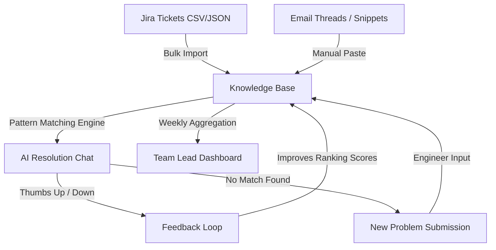

# Product Requirements Document: Incident Intelligence

*Version 1.0 — AI-Powered Incident Resolution Assistant for Investment Bank Production Teams*

---

## TL;DR

Incident Intelligence gives each production support team an AI-powered workspace that learns from their Jira tickets, email threads, and manual resolutions. When a P1 alert fires, engineers describe the error and instantly receive ranked solutions from their team's historical knowledge, eliminating the 30–60 minute search for past fixes. V1 targets Client Reporting teams at Tier-1 investment banks, creating a continuous learning loop that reduces resolution times with every solved incident.

---

## Problem Statement

### The Pain
Production support engineers at investment banks handle 50–200+ incidents per month. When an alert fires, the most time-consuming step is not diagnosis or resolution—it is **figuring out if anyone on the team has seen this problem before**. Finding historical context requires manually searching across Jira, email threads, Slack channels, and senior engineers' memories. **Result: 30–60 minutes of search time per incident, regardless of whether the problem was previously solved.**

### User Signal Evidence
- **r/sre (100k+ members):** *"Post-mortems are write-only documents."* Engineers repeatedly express frustration over solving exact duplicate issues because old runbooks or tickets cannot be found.
- **Blind (FinTech Engineers):** *"The biggest productivity killer isn't system complexity, it's institutional amnesia."* L2 engineers report new joiners take 6+ months to become effective due to trapped tribal knowledge.
- **Direct Observation:** Observed teammates spend 45 minutes uncovering a root cause buried in a 2-person email thread, while new joiners interrupt senior engineers 3–5 times per shift asking, *"have you seen this before?"*

### Why Existing Tools Fail
| Tool | What It Does Well | Where It Fails for Incident Resolution |
| :--- | :--- | :--- |
| **PagerDuty** | Alert routing & on-call scheduling | Optimizes for *speed of response*, not *quality of resolution*; zero historical context. |
| **Jira** | Ticket tracking & workflows | Keyword search misses semantically similar issues; resolutions buried in comments. |
| **Confluence** | Documentation & runbooks | Write-once-read-never culture; runbooks go stale within weeks. |
| **Slack** | Real-time communication | Ephemeral knowledge; noisy search; unstructured technical discussions. |

---

## Persona: Me & My Teammates — L2 Production Support Engineer

| Attribute | Detail |
| :--- | :--- |
| **Role & Team** | L2 Production Support Engineer, Client Reporting |
| **Experience** | 2–4 years at a Tier-1 investment bank |
| **Incident Load** | 8–12 incidents/week (mix of P1–P4, rotating shifts & overnight on-call) |
| **Primary Issues** | Statement generation failures, reconciliation mismatches, data discrepancy queries |
| **Daily Stack** | Jira, Slack, Email, PagerDuty, Internal Ops Dashboards |

- **Daily Friction:** Me & My Teammates spends 30 minutes searching Jira and Slack for a statement generation failure, only to ping a senior engineer who solves it from memory in 2 minutes. The knowledge stays trapped in Slack and memory.
- **Core Need:** *"I don't need AI to fix my problems. I need it to tell me: here are the last three times this happened, here's what worked, here's the ticket. Just save me the 30 minutes of searching."*

---

## Success Metrics

### North Star Metric
**Mean Time to Resolution (MTTR)** for incidents where AI suggestions were available.
- **Target (V1):** **30% reduction in MTTR** for incidents with ≥1 knowledge base match (reducing baseline 45–75 min resolutions to <30 min).

### Secondary & Guardrail Metrics
| Category | Metric | Target / Threshold |
| :--- | :--- | :--- |
| **Secondary** | **Repeat Incident Rate** | 25% reduction in recurring alert volume due to faster identification of root causes. |
| **Secondary** | **Escalation Accuracy** | >85% of escalations to L3/Infra include verified historical context and exact error logs. |
| **Secondary** | **AI Suggestion Acceptance Rate** | >40% of surfaced resolution suggestions receive positive (thumbs-up) feedback. |
| **Guardrail** | **False Positive Alert Rate** | <15% of surfaced suggestions deemed irrelevant (thumbs-down) by responding engineers. |
| **Guardrail** | **False Confidence** | **Zero** P1 incidents where a >80% confidence score leads an engineer to take incorrect action. |
| **Guardrail** | **Knowledge Base Staleness** | <10% of active knowledge base entries older than 6 months without review or validation. |

---

## Scope: In / Out

| Scope | Features | Rationale |
| :--- | :--- | :--- |
| **IN** | • Team-specific AI chat workspace • Manual knowledge ingestion (paste emails, snippets) • Pattern matching engine (keywords + category + tags) • Resolution ranking with confidence scores • Weekly digest dashboard for team leads • Mock Jira import via CSV/JSON | Delivers core value immediately without requiring complex bank API integrations or heavy infrastructure. Proves product-market fit and reduces search time. |
| **OUT** | • Live Jira API bidirectional integration • Cross-team knowledge sharing • Real-time alert ingestion (webhook automations) • Role-Based Access Control (RBAC) • Audit trails and compliance logging | Custom Jira instances and security policies delay shipping. Team isolation prevents search noise. RBAC/compliance add complexity without validating core UX. |

---

## Edge Cases

1. **Ambiguous Error Descriptions:** When engineers input vague descriptions (*"batch job failed again"*), the system gently nudges for structured context (category selection, error log paste, affected system) without enforcing rigid mandatory fields.
2. **Conflicting Resolutions:** If an error pattern has multiple historical fixes (e.g., *"restart renderer"* vs. *"increase heap allocation"*), the UI surfaces both alongside historical success rates, timestamps, and context, allowing the engineer to decide.
3. **Knowledge Base Cold Start:** To prevent an empty initial experience, V1 provides a bulk Jira CSV/JSON importer and pre-populated "seed knowledge" templates for common investment banking incident categories.

---

## Open Questions

1. **Confidence Score Weighting:** Should an exact keyword match from 6 months ago outrank a partial semantic match from last week? *(Current leaning: Recency-weighted scoring).*
2. **Auto-Creating KB Entries:** Should resolving a Jira ticket automatically draft a knowledge base entry? *(Current leaning: Auto-draft entry, but require 1-click engineer confirmation to filter out "fixed it" noise).*
3. **Stale Knowledge Decay:** How should we handle fixes for deprecated systems? *(Current leaning: Layered approach—automated score decay + manual "outdated" flags + 6-month review prompts).*
4. **"No Match" Experience:** When no relevant historical pattern exists, should the UI show "loosely related" entries from adjacent categories or prompt to submit a new problem? *(Current leaning: Prompt to submit new problem to avoid noise).*
5. **Pattern Engine Detail Level:** Should search results display concise resolution steps by default or full incident narratives? *(Current leaning: Concise summary by default, expandable to full narrative).*

---

## Data Flow Architecture

---

## Technical Approach

1. **Tokenization & Normalization:** Error logs and descriptions are stripped of noise, timestamps, and stop words.
2. **Multi-Signal Matching:** Evaluates keyword overlap (TF-IDF weighting), category alignment, system tags, and historical success rates.
3. **Confidence Scoring:** Calculates a weighted composite score adjusted by entry recency and engineer feedback (thumbs up/down).
