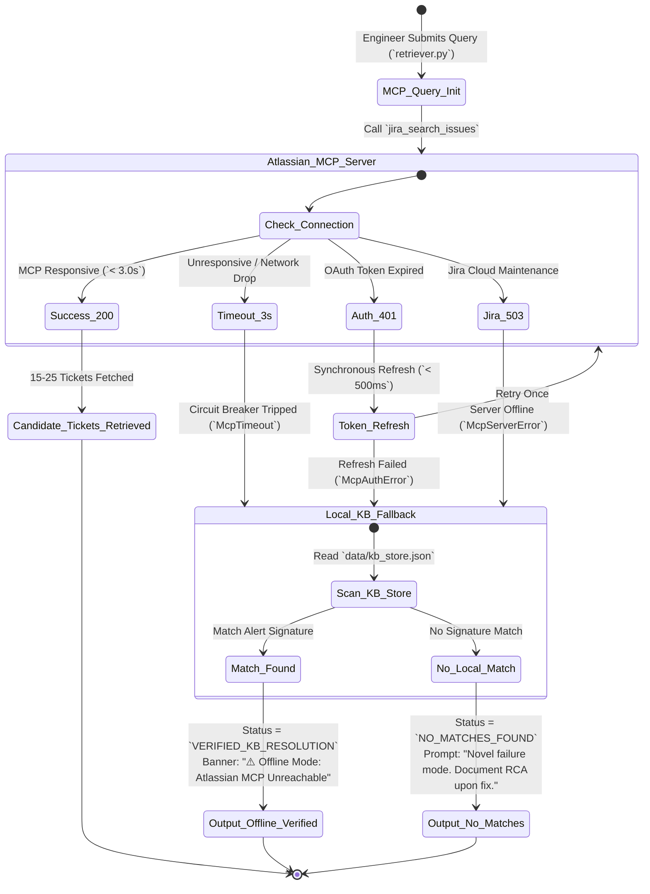

# Comprehensive Edge Cases & Anomaly Matrix: Incident Intelligence (v1 Prototype)
**Systemic Failure Scenarios, Operational Gotchas & Graceful Degradation Architecture**

---

## 1. Executive Summary & Resilience Philosophy

Production support workflows at investment banks operate under zero tolerance for downtime, strict data governance, and high alert volumes (**50–200+ incidents per month** across core reporting and reconciliation engines). During an active **2am P1 outage**, an engineer relying on **Incident Intelligence (v1)** cannot afford system crashes, unbounded query latencies (`> 15.0 seconds`), AI hallucinations, or unauthorized data exposures.

This document (`edgeCases.md`) establishes the master edge case taxonomy and architectural resilience blueprint directly derived from [problemStatement.md](file:///c:/Users/GS/Desktop/Incident%20Intelligence/problemStatement.md) and [ArchitecturePlan.md](file:///c:/Users/GS/Desktop/Incident%20Intelligence/ArchitecturePlan.md). Every anomaly—whether triggered by user error, malformed stack traces, Atlassian MCP server disconnections, Groq free-tier rate limit hits (`30 RPM / 12,000 TPM`), or concurrent write-backs—is met with a deterministic mitigation mechanics ensuring **Fail-Safe Grounding** and **Graceful Degradation**.

### Core Resilience Principles
- **Zero Hallucination Under Stress:** If candidate ticket retrieval or semantic evaluation returns ambiguous results, the system explicitly flags `LOW_CONFIDENCE_SPARSE` or `NO_MATCHES_FOUND` rather than fabricating synthetic precursor conditions or imaginary resolution steps.
- **Mandatory Project Scoping:** No input string or LLM instruction can bypass the non-bypassable structural guardrail (`PROJECT in ("{JIRA_PROJECT_KEYS}") AND ... ORDER BY created DESC`). Global searches across institutional Jira instances are structurally blocked.
- **Sub-15 Second Hard SLA:** Every external network call (`Groq Cloud API` and `Atlassian MCP Server`) is bounded by strict timeout circuit breakers (`3.0s – 4.0s max`). If external dependencies time out, the pipeline instantly degrades to local index retrieval (`data/kb_store.json`) or deterministic keyword scoring to preserve the **< 10–15 second SLA**.
- **Idempotent Continuous Learning:** All post-resolution capture write-backs (`jira_add_comment` / `jira_create_issue`) enforce deduplication hashes to prevent race conditions and duplicate tickets when multiple shift leads respond concurrently.

---

## 2. Category 1: Input & Query Anomalies (`Client & JQL Scoping Layer`)

During high-stress outages, L1/L2 engineers paste raw, unfiltered text directly from production consoles into the triage input. The system must sanitize, truncate, and scope all inputs before execution.

| Edge Case ID | Scenario & Anomaly Description | Architectural Impact & Risk | Automated Mitigation Mechanics (`ArchitecturePlan.md` Module) | Expected System Response & Output Card |
| :---: | :--- | :--- | :--- | :--- |
| **EC-1.1** | **Massive Multi-Page Stack Trace Submission (`Prompt Overflow`)**<br>Engineer pastes a 25,000-character Java Spring / JVM memory dump with hundreds of nested stack frames. | Exceeds Groq context window (`3,500 token ceiling`) or exhausts the `12,000 TPM` rate limit during JQL translation and semantic grounding. | `jql_translator.py` and `semantic_filter.py` execute mandatory preprocessing truncation (`truncate_alert_trace(alert_trace, max_chars=1500)` for JQL extraction and `max 500 chars` for candidate description matching). | Pipeline executes smoothly within token budget (`~1.5s latency`). Extracts core exception (`MemoryPoolExhaustedException`) and target node (`app-client-rep-04`). |
| **EC-1.2** | **Vague or Extremely Short Alert Queries (`Ambiguity Noise`)**<br>Engineer inputs a generic 3-word phrase such as `"error on node"` or `"batch job failed"`. | JQL translation produces non-distinct search terms (`text ~ "error"`), causing `jira_search_issues` to retrieve 20 completely unrelated candidate tickets across distinct microservices. | `backend/models.py` enforces `min_length=10`. For generic strings lacking specific class names or job IDs (`len < 25`), `semantic_filter.py` assigns `confidence_score < 0.50` to all candidates due to lack of root-cause alignment. | Returns `confidence_status = NO_MATCHES_FOUND` or `LOW_CONFIDENCE_SPARSE` with explicit guidance: *"Query too broad (`batch job failed`). Please paste the specific exception class or batch run ID to isolate verified historical patterns."* |
| **EC-1.3** | **Prompt Injection / Scoping Bypass Attempt**<br>User or compromised log payload submits: `"MemoryPoolExhausted OR 1=1) AND PROJECT in ('HR_PAYROLL') --"`. | Attempt to break out of mandatory project scoping (`CREP,OPS`) to access confidential HR, legal, or trading desk Jira tickets. | Non-bypassable regex structure enforcement in `jql_translator.py`. The translator strips explicit `PROJECT in (...)` strings from LLM output or user input, forcefully wrapping sanitized terms inside `f'PROJECT in ("{JIRA_PROJECT_KEYS}") AND ({sanitized_terms}) ORDER BY created DESC'`. | Scoped query executes strictly against `CREP`/`OPS`. Attempted injection terms (`HR_PAYROLL`) are treated as literal text literals inside parens, returning `0 matches` or safe project matches without compliance leaks. |
| **EC-1.4** | **Special Character & JQL Syntax Injection (`Malformed Query Crash`)**<br>Alert string contains unescaped JQL reserved chars: `[ ] ( ) + - ! * ? ~ ^ { } " \ :`. | Unescaped characters passed directly into Atlassian MCP `jira_search_issues` cause Atlassian Jira Cloud to throw `HTTP 400 Bad Request (JQL Syntax Error)`. | `jql_translator.py` applies `escape_jql_terms()` to sanitize and quote all literal strings (`text ~ "\"MemoryPoolExhaustedException\""`). If Jira returns `400 Bad Request`, `retriever.py` catches `McpToolExecutionError`, strips complex operators, and retries once with alphanumeric keyword search. | Clean retrieval of candidate tickets (`< 3.0s total latency`) without surfacing raw 400 JQL syntax stack traces to the responding engineer. |

---

## 3. Category 2: External Protocol & Dependency Failures (`Atlassian MCP Layer`)

Incident Intelligence relies on the Atlassian MCP Server (`mcpservers.org`) connecting over `stdio` or `SSE` to Jira Cloud. Network drops or authentication failures must trigger instant fallbacks.



### Detailed Atlassian MCP Failure Matrix
1. **Atlassian MCP Server Unreachable / Timeout (`McpConnectionError`) (`EC-2.1`)**:
   - *Trigger:* `stdio` subprocess crashes or remote `SSE` endpoint fails to respond within `3.0 seconds`.
   - *Architectural Mitigation:* Circuit breaker in `backend/mcp_client.py` trips immediately upon `McpConnectionError`. `retriever.py` switches to **Local Knowledge Fallback Mode**, querying `data/kb_store.json`.
   - *Output Card:* If verified `[KB_ENTRY]` records match the alert signature in local JSON, outputs `VERIFIED_KB_RESOLUTION` with warning: *"⚠️ Offline Mode: Atlassian MCP Server unreachable. Showing verified local knowledge base entries (`data/kb_store.json`)."* Latency: `< 0.2s`.
2. **OAuth Token Expiration During 2am Outage (`HTTP 401 Unauthorized`) (`EC-2.2`)**:
   - *Trigger:* Atlassian OAuth bearer token expires right when an alert query is initiated.
   - *Architectural Mitigation:* `mcp_client.py` intercepts `401 Unauthorized`, invokes synchronous token refresh using `ATLASSIAN_MCP_CONFIG` refresh credentials (`< 500ms`), and retries `jira_search_issues` exactly once. If refresh fails, trips `Local_KB_Fallback`.
3. **Jira Cloud Maintenance or Rate Limit (`HTTP 503 / 429`) (`EC-2.3`)**:
   - *Trigger:* Atlassian Cloud instance returns `503 Service Unavailable` or `429 Too Many Requests`.
   - *Architectural Mitigation:* `retriever.py` logs `McpAtlassianCloudError`, bypasses external Jira querying entirely for `300 seconds` (circuit breaker open state), and serves queries strictly from `data/kb_store.json` index.

---

## 4. Category 3: LLM & Token Budgeting Edge Cases (`Groq Cloud & Rate Limits`)

The system operates under Groq Free-Tier constraints (**30 Requests per Minute / 12,000 Tokens per Minute**). Outage cascades generating burst queries must not crash the tool.

| Edge Case ID | Scenario & Anomaly Description | Architectural Impact & Risk | Automated Mitigation Mechanics (`ArchitecturePlan.md` Module) | Expected System Response & Output Card |
| :---: | :--- | :--- | :--- | :--- |
| **EC-3.1** | **Groq Free-Tier Rate Limit Hit (`HTTP 429 / 12,000 TPM Hit`)**<br>During a cascading statement generation failure, 10 engineers query the tool simultaneously within 60 seconds. | Groq Cloud API returns `HTTP 429 Too Many Requests` due to exceeding `12,000 TPM` or `30 RPM` thresholds. | 1. `LRUCache` (`backend/cache.py`) intercepts exact/near-identical active outage repeats (`MD5 hash` of normalized error), serving cached `PatternResponse` (`0 Groq tokens used`).<br>2. For unique queries hitting `429`, `llm_client.py` executes exponential backoff jitter (`0.5s -> 1.0s -> 2.0s`).<br>3. If `429` persists past `3.0s`, `semantic_filter.py` and `pattern_engine.py` switch to **Deterministic Keyword Matching Engine** (scoring by exact term overlap and extracting latest ticket comment without LLM synthesis). | Structured pattern card delivered within **< 12.0s SLA**. Banner displayed: *"⚡ High Query Volume: Evaluated via deterministic keyword grouping (LLM rate ceiling reached)."* |
| **EC-3.2** | **Conflicting / Contradictory Historical Precursors (`Hallucination Risk`)**<br>Candidate tickets show scattered precursors (2 tickets say `"deploy script"`, 2 say `"network drop"`, 2 say `"DB lock"`). | LLM might hallucinate a composite, non-existent precursor condition (`"network drop during DB lock after deploy script"`). | Enforced **>50% Strict Majority-Rule Prompting** (`backend/pattern_engine.py`). The prompt (`MAJORITY_PATTERN_EXTRACTION_PROMPT`) explicitly instructs `llama-3.3-70b-versatile` that a precursor can **ONLY** be declared if it appears across `>50%` of matched candidates. | Output `precursor_condition: "No single dominant precursor condition across matches (varied triggers)."` Displays distinct sample tickets rather than fabricating a false consensus. |
| **EC-3.3** | **Groq Cloud API Latency Spike (`LLM Timeout > 5.0s`)**<br>Groq cloud experiences high server load; `llama-3.3-70b-versatile` generation takes `> 6.0 seconds`. | Threatens the hard **15.0 second SLA ceiling**, risking terminal timeouts or UI spinning hangs during 2am triage. | Timeout circuit breaker on `GroqClientWrapper.generate()` set to `4.5 seconds` per stage. If Stage 3 (`Semantic Grounding`) or Stage 4 (`Pattern Synthesis`) times out, the pipeline short-circuits to deterministic stats calculation (`stats_calculator.py`). | Returns `confidence_status = LOW_CONFIDENCE_SPARSE` (`Execution status: Keyword grouping due to LLM latency spike`). Direct Jira URLs and exact date ranges delivered within **< 10.0s**. |

---

## 5. Category 4: Pattern Synthesis & Data Distribution Edge Cases (`Pattern Engine`)

Historical Jira ticket distributions can be sparse, noisy, or contain newly externalized resolution overrides.

```
       [ Candidate Tickets Retrieved from Atlassian MCP ]
                               │
                               ▼
        [ Semantic Filter Grounding via Groq LLM ]
                               │
                               ▼
     ┌──────────────────────────────────────────────────┐
     │  Does ANY candidate ticket possess a verified    │
     │  [INCIDENT_INTELLIGENCE_KB_ENTRY] comment tag?   │
     └──────────────────────────────────────────────────┘
                    │                      │
             YES    │                      │   NO
                    ▼                      ▼
  ┌───────────────────────────┐  ┌───────────────────────────┐
  │  INSTANT PRIORITY BOOST   │  │  Evaluate Match Count:    │
  │  Status: VERIFIED_KB      │  │  len(verified_matches)    │
  │  Override <3 Sparse Check │  └───────────────────────────┘
  │  Output Exact Fix Steps   │                 │
  └───────────────────────────┘         ┌───────┴───────┐
                                        │               │
                                   count < 3       count >= 3
                                        ▼               ▼
                        ┌──────────────────────┐ ┌──────────────────────┐
                        │ LOW_CONFIDENCE_SPARSE│ │ HIGH_CONFIDENCE_PAT  │
                        │ Show 1-2 Links Only  │ │ Execute >50% Majority│
                        │ Suppress Precursor & │ │ Extract Precursor &  │
                        │ Owner Claims         │ │ Dominant Owner       │
                        └──────────────────────┘ └──────────────────────┘
```

### Detailed Pattern Distribution Scenarios
1. **Sparse Match Boundary Check (`len(verified_matches) in [1, 2]`) (`EC-4.1`)**:
   - *Scenario:* Only 1 or 2 historical tickets match the `MemoryPoolExhaustedException` error signature.
   - *Architectural Impact:* Declaring a generalized, systemic "pattern" from 1–2 occurrences leads engineers down false diagnostic paths based on one-off historical anomalies.
   - *Mitigation & Output:* `pattern_engine.py` verifies `len(verified_matches) < 3`. Unless `has_verified_kb_entry == True`, the engine sets `confidence_status = LOW_CONFIDENCE_SPARSE`. It populates `top_ticket_links` (`browse/CREP-104`) but explicitly suppresses generalized precursor and owner claims: *"⚠️ Low Confidence: Only {count} historical match(es) found. This does not yet establish a verified recurring pattern."*
2. **Verified KB Entry Priority Override on Sparse Match (`count=1, but has [KB_ENTRY]`) (`EC-4.2`)**:
   - *Scenario:* An engineer documented a novel fix yesterday via `/api/v1/capture-resolution`. Today, the exact same alert triggers (`count=1`).
   - *Architectural Impact:* Under standard sparse rules (`< 3 matches`), this exact verified resolution would be warned as low confidence.
   - *Mitigation & Output:* `retriever.py` and `semantic_filter.py` scan comment strings and `kb_store.json` for `[INCIDENT_INTELLIGENCE_KB_ENTRY]`. When detected, `pattern_engine.py` assigns `confidence_status = VERIFIED_KB_RESOLUTION`, overrides the `< 3 matches` sparse warning, and immediately outputs the documented step-by-step fix with highest priority.
3. **Zero Matches Found (`len(verified_matches) == 0`) (`EC-4.3`)**:
   - *Scenario:* A completely new exception occurs (`NullPointerException in stmt_reconcile_v3`).
   - *Mitigation & Output:* Returns `confidence_status = NO_MATCHES_FOUND` (`pattern_count = 0`). Renders clean card: *"No historical matches found in project CREP. This appears to be a novel failure mode."* Highlights the **"📝 Document New Resolution"** action modal to capture the RCA upon resolution (`JTBD 2`).

---

## 6. Category 5: Continuous Learning & Write-Back Conflicts (`learning_loop.py` & `kb_writer.py`)

When engineers resolve novel outages at 2am and document their findings via the UI/CLI modal (`POST /api/v1/capture-resolution`), write-back collisions and Jira synchronization errors must be handled gracefully.

| Edge Case ID | Scenario & Anomaly Description | Architectural Impact & Risk | Automated Mitigation Mechanics (`ArchitecturePlan.md` Module) | Expected System Response & Output Card |
| :---: | :--- | :--- | :--- | :--- |
| **EC-5.1** | **Concurrent Resolution Capture Submissions (`Race Condition`)**<br>Two L2 shift leads independently click **"📝 Document New Resolution"** for the exact same active outage within 5 seconds of each other. | Duplicate comments appended via `jira_add_comment` or duplicate Known-Error tickets created via `jira_create_issue`, cluttering Jira queues. | `kb_writer.py` generates an idempotency hash (`SHA-256(alert_signature + precursor_condition)`). Before invoking Atlassian MCP tools, it checks `data/kb_store.json` and ticket comments for an identical hash within the last `30 minutes`. | First submission creates the KB entry (`CREP-189`). Second submission detects idempotency hash match, skips duplicate creation, merges any new fix notes, and returns success pointing to `CREP-189`. |
| **EC-5.2** | **Atlassian MCP Write-Back Permission Failure (`HTTP 403 / Read-Only Jira`)**<br>Jira Cloud is placed in read-only maintenance mode right when an engineer submits a new resolution payload. | `execute_add_comment` or `execute_create_issue` throws `McpPermissionError` or `HTTP 403 Forbidden`, risking total loss of the engineer's fresh resolution documentation. | **Dual Storage Fallback Strategy:** `kb_writer.py` catches `McpToolExecutionError` (`403 / 503`), logs an asynchronous retry queue entry (`pending_jira_sync.log`), and immediately persists the full `KnowledgeBaseEntry` to `data/kb_store.json` (`sync_status = PENDING_JIRA_SYNC`). | Returns UI success toast: *"✅ Resolution indexed to local knowledge store (`VERIFIED_KB_RESOLUTION` active). Jira write-back queued until cloud maintenance completes."* |
| **EC-5.3** | **Malformed or Blank Resolution Narrative Submission (`Validation Rejection`)**<br>Engineer accidentally clicks submit on the modal while `precursor_condition` or `resolution_narrative` is blank or `< 5 words`. | Storing incomplete or blank resolutions (`"fixed it"`) pollutes the `[KB_ENTRY]` index, resulting in unhelpful instant priority overrides on future triage runs. | `ResolutionCaptureRequest` (`backend/models.py`) enforces strict Pydantic v2 validation: `precursor_condition (min_length=15)` and `resolution_narrative (min_length=30)`. | FastAPI Gateway rejects request with `HTTP 422 Unprocessable Entity`. Modal displays clear inline validation: *"Please provide at least 30 characters detailing the step-by-step resolution so future shift engineers can apply this fix."* |

---

## 7. Master Graceful Degradation & SLA Guarantee Matrix

This matrix maps all failure tiers to their exact system state, fallback behavior, and end-to-end latency impact, demonstrating that **Incident Intelligence (v1 Prototype)** guarantees actionable triage output within the **< 15.0s SLA** under any operational anomaly.

| Failure / Anomaly Tier | Primary Error Trigger | Automated Circuit Breaker / Fallback Action | Final Output Card Status & Visual Badge | End-to-End Latency Guarantee |
| :--- | :--- | :--- | :--- | :--- |
| **Normal Optimal Operation** | All APIs (`Groq Cloud`, `Atlassian MCP Server`) responsive and healthy. | Full 4-stage pipeline: Scoped JQL -> MCP Search -> Groq Semantic Grounding -> Majority Pattern Synthesis. | `HIGH_CONFIDENCE_PATTERN` (if `>=3`) or `VERIFIED_KB_RESOLUTION` (if `[KB_ENTRY]` exists). | **`8.0s – 13.5s`** (`Optimal SLA`) |
| **Active Outage Repeat Query** | Identical/near-identical alert trace submitted within 15-minute rolling window. | `LRUCache` hit (`backend/cache.py`). Bypasses JQL translation, Atlassian MCP, and Groq grounding entirely. | Exactly matches previous cached card status (`HIGH_CONFIDENCE` / `VERIFIED_KB`). | **`< 0.05s`** (`0 Groq tokens used`) |
| **Groq LLM Rate Limit Hit** | `HTTP 429 Too Many Requests` (`> 12,000 TPM` / `30 RPM` ceiling crossed). | Exponential backoff retry (`0.5s->1.0s`). If unresolved by `3.0s`, falls back to **Deterministic Keyword Matching Engine**. | `HIGH_CONFIDENCE` or `LOW_CONFIDENCE` + Banner: *"Evaluated via deterministic keyword grouping (LLM rate ceiling reached)."* | **`10.0s – 14.5s`** (`Inside SLA`) |
| **Atlassian MCP Server Offline** | `McpConnectionError` / `Timeout > 3.0s` calling `jira_search_issues`. | Circuit breaker opens. Switches immediately to **Local Knowledge Fallback Mode (`data/kb_store.json`)**. | `VERIFIED_KB_RESOLUTION` (if signature in local KB) or `NO_MATCHES_FOUND` + Banner: *"⚠️ Offline Mode: Atlassian MCP Unreachable."* | **`< 3.5s`** (`Fast Offline Fallback`) |
| **Jira Cloud Maintenance / 503** | Atlassian Cloud returns `HTTP 503 Service Unavailable` on MCP query. | `retriever.py` opens Atlassian circuit breaker (`300s TTL`), serving exclusively from local `kb_store.json` index. | `VERIFIED_KB_RESOLUTION` or `NO_MATCHES_FOUND` + Banner: *"⚠️ Atlassian Cloud in maintenance mode."* | **`< 2.5s`** (`Fast Offline Fallback`) |
| **Sparse Historical Matches** | `len(verified_matches) in [1, 2]` AND no `[KB_ENTRY]` tag detected. | Blocks `>50%` majority precursor/owner extraction to prevent single-ticket anomalies from misleading triage. | `LOW_CONFIDENCE_SPARSE` + 1-2 clickable Jira links (`browse/CREP-104`) + Warning Banner. | **`8.5s – 12.0s`** (`Inside SLA`) |
| **Groq Cloud API Latency Spike** | `llama-3.3-70b-versatile` generation exceeds `4.5s` stage timeout. | Short-circuits LLM grounding/synthesis. Executes `stats_calculator.py` and keyword overlap scoring. | `LOW_CONFIDENCE_SPARSE` + Banner: *"Execution fallback: Keyword grouping due to cloud LLM latency spike."* | **`11.0s – 14.8s`** (`Strictly < 15.0s`) |
| **Concurrent KB Write-Back** | Race condition: two engineers submit `/api/v1/capture-resolution` simultaneously. | Idempotency hash (`SHA-256`) checked in `kb_store.json` prior to calling `jira_add_comment` / `jira_create_issue`. | Second request merged/deduplicated cleanly. Returns success toast with shared `kb_id` (`CREP-189`). | **`< 1.8s`** (`Idempotent Write`) |

---
*Generated based on [ArchitecturePlan.md](file:///c:/Users/GS/Desktop/Incident%20Intelligence/ArchitecturePlan.md) and [problemStatement.md](file:///c:/Users/GS/Desktop/Incident%20Intelligence/problemStatement.md) for the Incident Intelligence portfolio project.*
